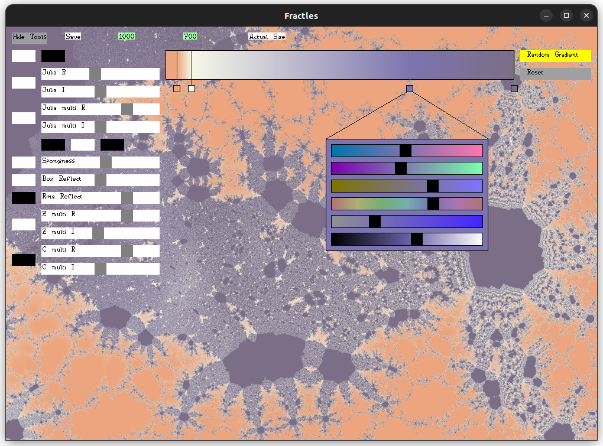

# Fractles

An old, quirky fractal renderer from circa 2016. Written in C++ with SDL featuring a weird homebrew GUI library and some dodgy multithreading but it _seems to work._ ;-)

## Features
- Multithreaded interactive CPU rendering
- Anti-aliasing
- Mandelbrot set
- Julia sets
- Mandelbox
- Custom colour gradients
- Custom resolutions
- PNG export

## Usage

### Key bindings
- W/A/S/D : move view up/down/left/right
- Up/Down Arrow : zoom in/out
- R : random colour gradient
- Enter: save PNG image

### Detailed instructions

Please refer to images in the `examples/` directory for detailed GUI instructions and some prototypical setups.

## Further reading

- [Wikipedia article on the Mandelbrot set](https://en.wikipedia.org/wiki/Mandelbrot_set)
- [Wikipedia article on Julia sets](https://en.wikipedia.org/wiki/Julia_set)
- [Wikipedia article on the Mandelbox](https://en.wikipedia.org/wiki/Mandelbox)